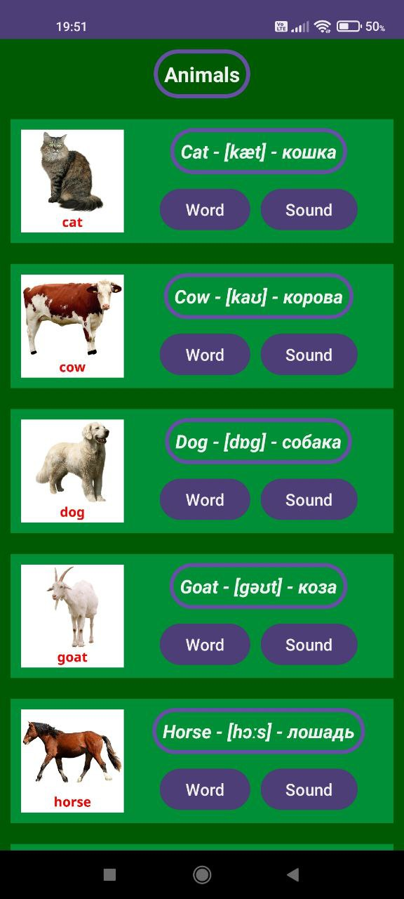

# Android Practice 3

## Task

Write an application that works with `RecyclerView`. Each RecyclerView element must consist of **at least two elements** (for example, a text and an image, a text and a button, etc.). The topic can be any.

## Screen

This version of the application is written in **Kotlin**

